# Improve Warehouse Productivity using Order Batching with Python 📦 #

In a **Distribution Center (DC)**, walking time from one location to another during picking route can account for 60% to 70% of the operator’s working time. Reducing this walking time is the most effective way to increase your DC overall productivity.

  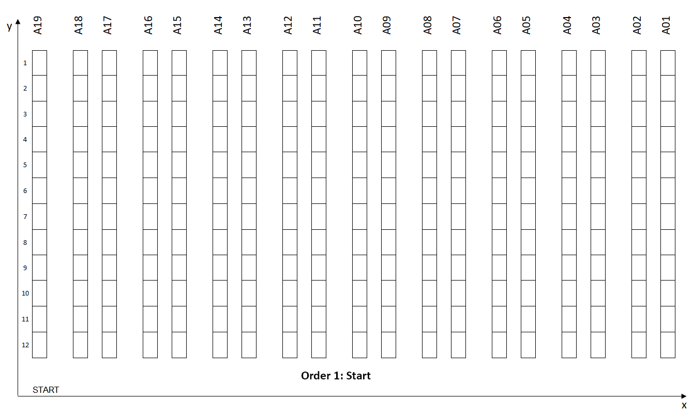

<b>Scenario 1:</b> Picking routes with 1 order picked per wave.

## > :rocket: **Thank you for your interest in my work.** :blush: ##

This solution aims at developing a Web Application for **Supply Chain Professionals** to help them simulate the impact on picking route optimization in the total distance of their picking operators.

It leverages rich and diverse priors encapsulated with pretrained **Python Queries**.

I have published this article that propose an approach to  design a model to simulate the impact of several picking processes and routing methods to find optimal order picking by using the **Single Picker Routing Problem (SPRP)** for a two-dimensional warehouse model (axis-x, axis-y).

SPRP is a specific application of the general **Traveling Salesman Problem (TSP)** answering the question:
>  “Given a list of storage locations and the distances between each pair of locations, what is the shortest possible route that visits each storage location and returns to the depot?”

This repository contains a ready-to-use **Streamlit App** designed for **Logistics Professionals** to test these different strategies by only uplooading their own dataset of order line records.

# Picking Route Optimization 🚶‍♂️ #

## 💾 **Initial: Prepare Order Line Datasets with Picking Locations** ##

Based on the **actual warehouse layout**, storage locations are mapped with **2-D (x, y) coordinates** that will be used to measure walking distance.

  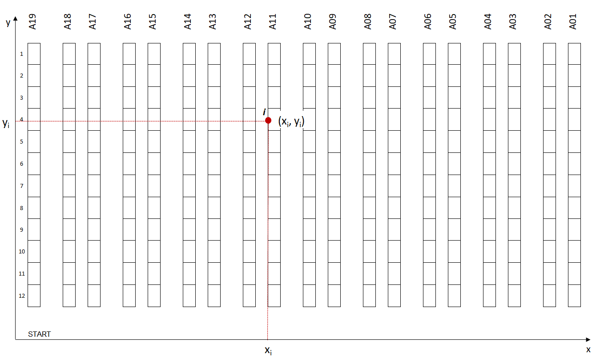

<b>Figure 1:</b> Warehouse Layout with 2D Coordinates.

Every storage location must be linked to a Reference using Master Data. (For instance, reference #123129 is located in coordinate (xi, yi)). You can then associate every order line to a geographical location for picking.

  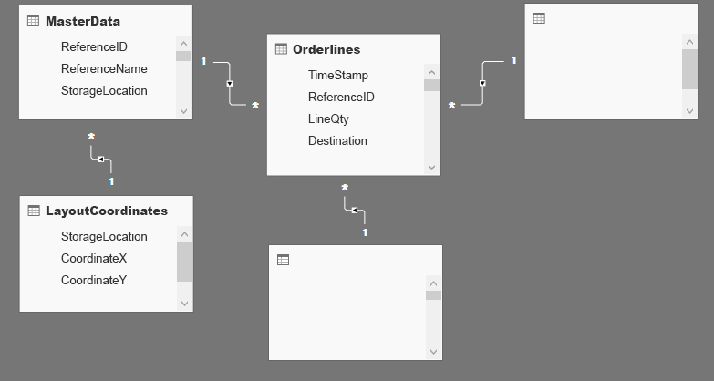
   

<b>Figure 2:</b> Database Schema.

Order lines can be extracted from your WMS Database, this table should be joined with the Master Data table to link every order line to a storage location and its (x, y) coordinate in your warehouse. Extra tables can be added to include more parameters in your model like (Destination, Delivery lead time, Special Packing, ..).

### ✔️ Problem Statement ###

For this study, we will use the example of E-Commerce type DC where items are stored in 4 level shelves. These shelves are organized in multiple rows (Row#: 1 … n) and aisles (Aisle#: A1 … A_n).

  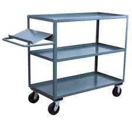
  

<b>Figure 3:</b> Large Warehouse Trolley.

#### Different routes between two storage locations in the warehouse ####

1. Items Dimensions: Small and light dimensional items.
2. Picking Cart: Lightweight picking cart with a capacity of 10 orders.
3. Picking Route: Picking Route starts and ends at the same location.

**Scenario 1**, the worst in terms of productivity, can be easily optimized because of:
- Locations: Orders #1 and #2 have common picking locations.
- Zones: Orders have picking locations in a common zone.
- Single-line Orders: Items_picked/walking_distance efficiency is very low.

  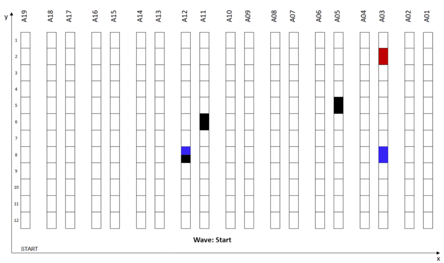
  

<b>Scenario 2:</b> Wave Picking applied to Scenario 1.

The first intuitive way to optimize this process is to combine these three orders in one picking route — this strategy is commonly called Wave Picking.

We are going to build a model to simulate the impact of several Wave Picking strategies in the total walking distance for a specific set of orders to prepare.

## 📊 Simulation ##

In the article, I have built a set of functions needed to run different scenarios and simulate the pickers walking distance.

**Function:** Calculate distance between two picking locations.

  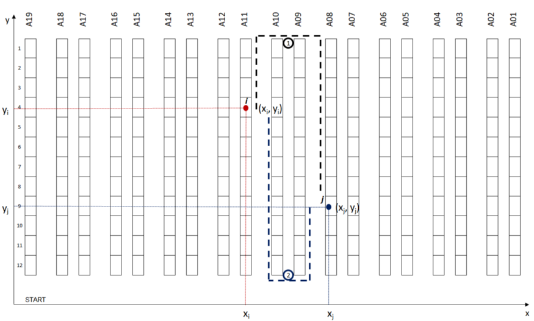
  

<b>Figure 4:</b> Different routes between two storage locations in the warehouse.

This function will be used to calculate the walking distance from a point i (xi, yi) and j (xj, yj).

**Objective:** return the shortest walking distance between the two potential routes from point i to point j.
> Parameters
- y_low : lowest point of your alley (y-axis)
- y_high : highest point of your alley (y-axis)

**Function:** The Next Closest Location.

  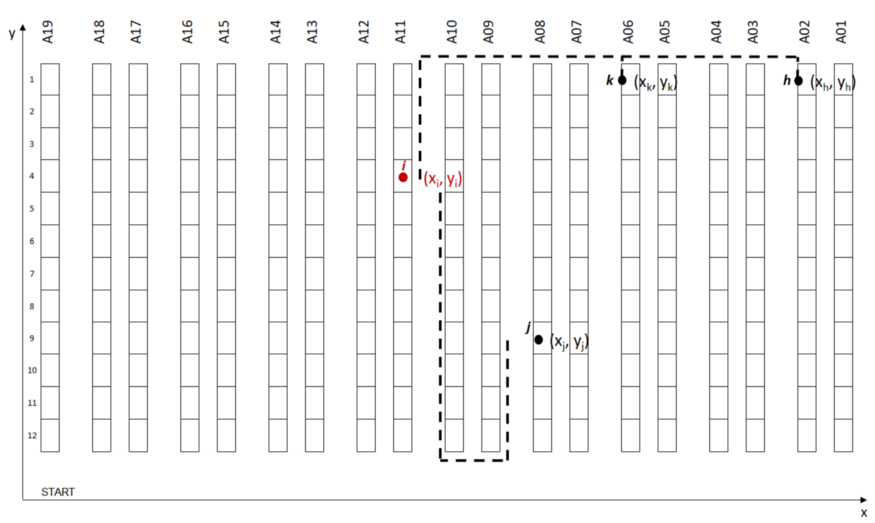
  

<b>Figure 5:</b> Next Storage Location Scenario.

This function will be used to choose the next location among several candidates to continue your picking route.

**Objective:** return the closest location as the best candidate.

This function will be used to create your picking route from a set of orders to prepare.
- Input: A list of (x, y) locations based on items to be picked for this route.
- Output: An ordered sequence of locations covered and total walking distance.

**Function:** Create batches of n orders to be picked at the same time.
- Input: Order lines data frame (df_orderlines), number of orders per wave (orders_number).
- Output: Data frame mapped with wave number (Column: WaveID), the total number of waves (waves_number).

**Function:** Listing picking locations of wave_ID picking route.
- Input: Order lines data frame (df_orderlines) and wave number (waveID).
- Output: List of locations i(xi, yi) included in your picking route.

## ☑️ **Results and Next Steps** ##

After setting up all necessary functions to measure picking distance, we can now test our picking route strategy with picking order lines.

Here, we first decided to start with a very simple approach:
- Orders Waves: Orders are grouped by chronological order of receiving time from OMS (TimeStamp).
- Picking Route: Picking route strategy is following the Next Closest Location logic.

To estimate the impact of wave picking strategy on your productivity, we will run several simulations with a gradual number of orders per wave:
1. Measure Total Walking Distance: How much walking distance is reduced when the number of orders per route is increased?
2. Record Picking Route per Wave: Recording the sequence of locations per route for further analysis.

  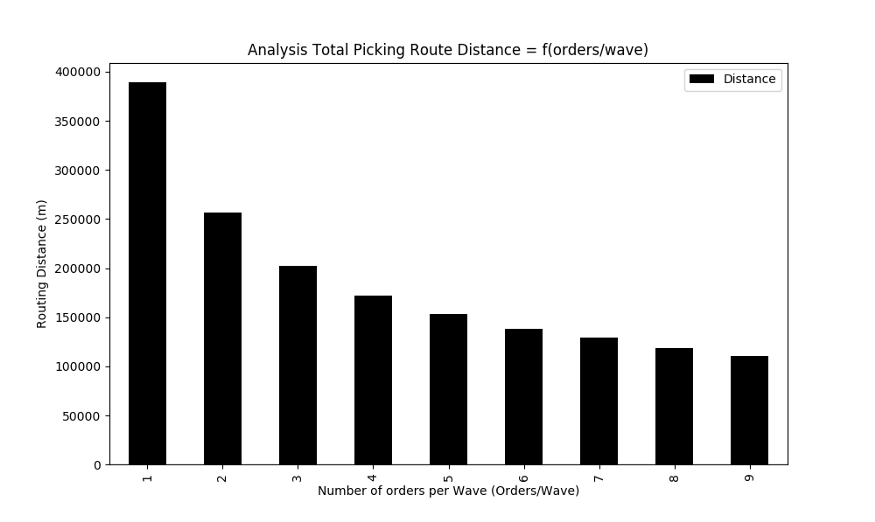
  

<b>Experiment 1:</b> Results for 5,000 order lines with a ratio from 1 to 9 orders per route.

  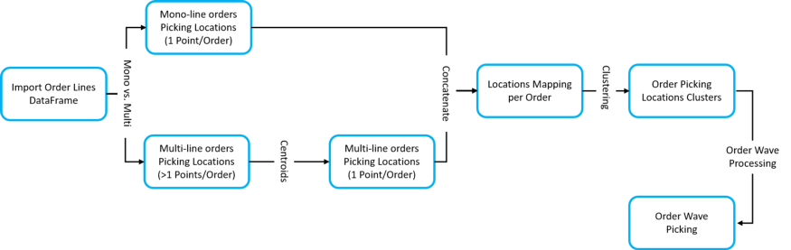
  

<b>Figure 6:</b> Order Lines Processing for Order Wave Picking using Clustering by Picking Location.

### 💡**Idea: Picking Locations Clusters** ###

Group picking locations by clusters to reduce the walking distance for each picking route. _(Example: the maximum walking distance between two locations is <15 m)_

Spatial clustering is the task of grouping together a set of points in a way that objects in the same cluster are more similar to each other than to objects in other clusters.

For this part we will split the orders in two categories:
- Mono-line orders: They can be associated to a unique picking locations.
- Multi-line orders: That are associated with several picking locations.

#### 🗳**Mono-line orders** ####

  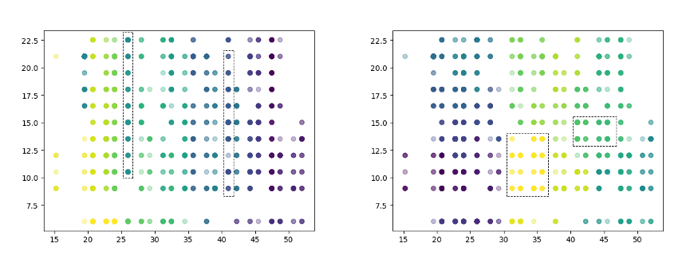
   

Left [Clustering using Walking Distance] / Right [Clustering using Euclidian Distance]

_Grouping orders in cluster within n meters of walking distance_

#### 🗳**Multi-line orders** ####

  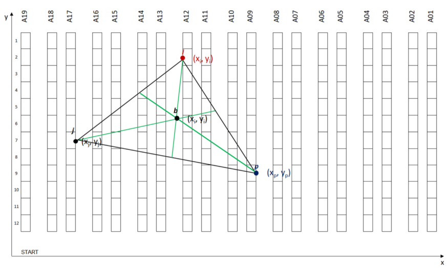
  

<b>Figure 7:</b> Centroid of three Picking Locations.

_Grouping multi-line orders in cluster (using centroids of picking locations) within n meters of walking distance_

### 🐁 **Model Simulation** ###

#### **Methodology** ####

To sum up, our model construction, see the chart below, we have several steps before Picking Routes Creation using Wave Processing.

At each step, we have a collection of parameters that can be tuned to improve performance:

  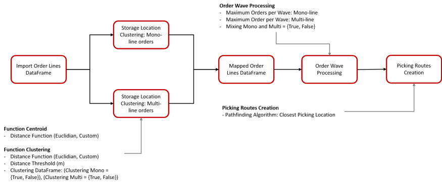
  

<b>Figure 8:</b> Methodology - Model Construction with Parameters.

#### **Comparing three methods of wave creation** ####

  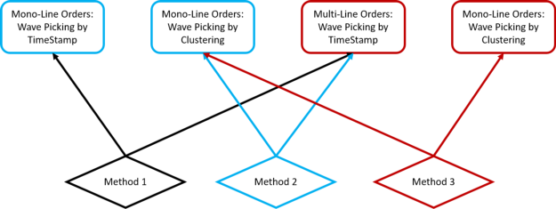
  

<b>Figure 9:</b> Methodology - Three Methods for Wave Processing.

We’ll start first by assessing the impact of Order Wave processing by clusters of picking locations on total walking distance.

We’ll be testing three different methods:
- Method 1: We do not apply clustering (i.e Initial Scenario).
- Method 2: We apply clustering on single-line orders only.
- Method 3: We apply clustering to single-line orders and centroids of multiline orders.

#### **Parameters of Simulation** ####
- Order lines: 20,000 Lines
- Distance Threshold: Maximum distance between two picking locations _(distance_threshold = 35 m)_
- Orders per Wave: orders_number in [1, 9]

## **Final Results** ##

  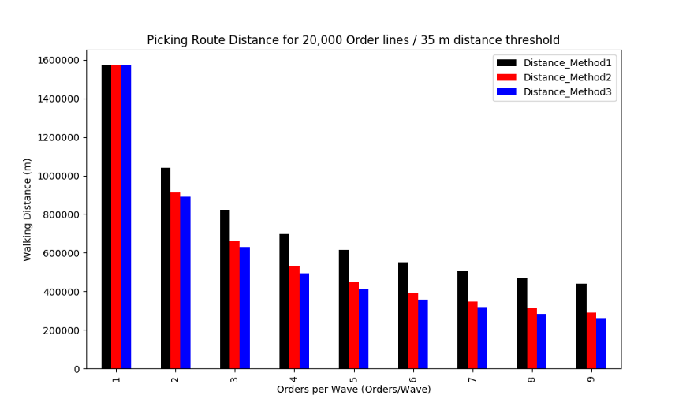
  

<b>Test 1:</b> 20,000 Order Lines / 35 m distance Threshold.

- Best Performance: Method 3 for 9 orders/Wave with 83% reduction of walking distance.
- Method 2 vs. Method 1: Clustering for mono-line orders reduce the walking distance by 34%.
- Method 3 vs. Method 2: Clustering for mono-line orders reduce the walking distance by 10%.

# Build the Application Locally 🏗️ #

Because the resources provided by Streamlit cloud or Heroku are limited, I would suggest to run this application locally.

## ✨ **Build a Python local environment (recommended)** ##

### Then install **virtualenv** using pip3 ###

    sudo pip3 install virtualenv 

### Now create a virtual environment ###

    virtualenv venv 
  
### Activate your virtual environment ###  
    
    source venv/bin/activate
  
## Launch Streamlit 🚀 ##

### Install all dependencies needed using requirements.txt ###

     pip install -r requirements.txt 

### Run the application ###

    streamlit run app.py --server.address 0.0.0.0 

### Click on the URL ### 
  

    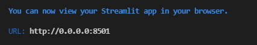
      
  

<b>Instructions:</b> Click on the URL.

  
> -> Enjoy!

# Use the application 🖥️ #
> This app has not been deployed, you need to use it locally.

## **Why should you use it?** ##
This Streamlit Web Application has been designed for **Supply Chain Professionals** to help them simulate the impact on picking route optimization in the total distance of their picking operators.

## **Load the data** ##

- You can use the dataset located in the folder: 
 [in/df_lines.csv](https://github.com/ianthropos88/route_picker/blob/main/static/in/df_lines.csv)
- You can build your own dataset following the step of ('Initial Step') above.

## 🔬 Experiment 1 ##

  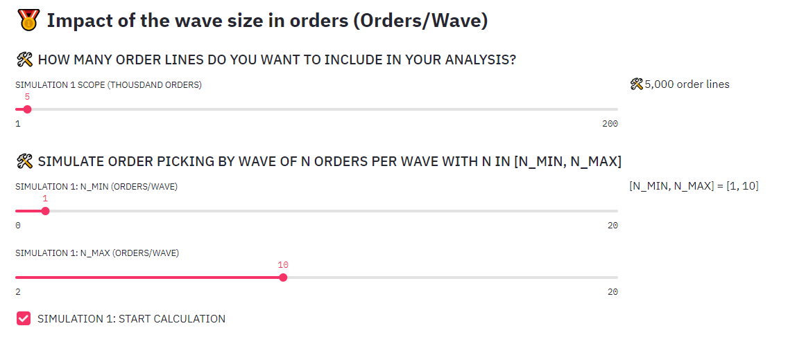
  

<b>Experiment 1:</b> Parameters.

### **Step 1:** Scope ###

As the computation time can increase exponentially with the size of the dataset _(optimization can be done)_ you can ask the model to take only the n thousands first lines for analysis.

### **Step 2:** Fix the range of orders/wave to simulate ###

In the picture below we ask the model to run a loop testing scenarios with the number of orders per wave varying between 1 to 10.

### **Step 3:** START CALCULATION ###

Click the button to start the calculations.

### **Final Results** ###

  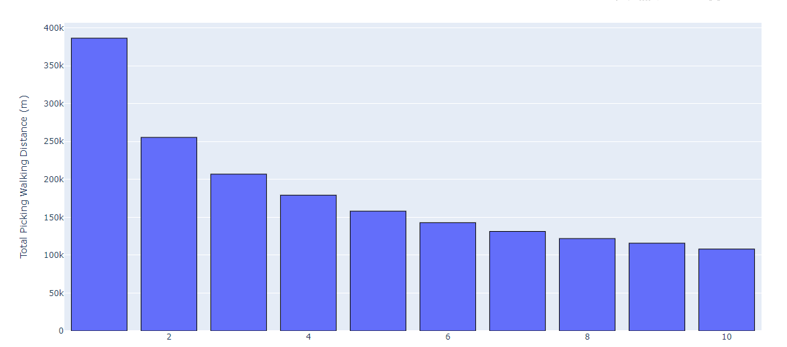
    

<b>Experiment 1:</b> Final Results.

💡 This is the same graph with the one presented in the article.

## 🧪 Experiment 2 ##

  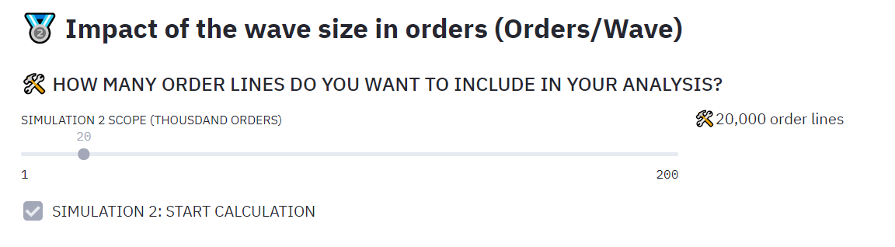
  

<b>Experiment 2:</b> Parameters

### **Step 1:** Scope ###

As the computation time can increase exponentially with the size of the dataset _(optimization can be done)_ you can ask the model to take only the n thousands first lines for analysis.

### **Step 2:** START CALCULATION ###

Click the button to start the calculations.

### **Final Results** ###

  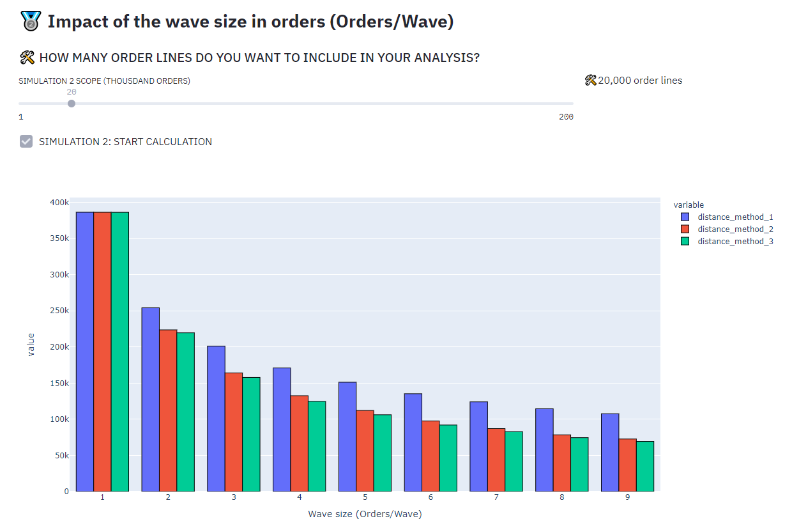

<b>Experiment 2:</b> Final Results.

💡 This is the same graph with the one presented in the article.

# About me 🤓
- With 10+ years of industry experience, I have thrived in Data Science, Data Governance, IT and Product Management. I have a keen interest and expertise in solving business problems using unique logic and analytics. I bring solutions to the table based on competitive Business Acumen and Human Intelligence.
- Have a look at my portfolio: [Helping organization level all their Seeds Business arguments using Data🔧 & Technology🔨 | Ex_Zalando | Ex_Freecharge | Ex_Myntra Jabong | Ex_Supercell | Ex_Infosys](https://www.linkedin.com/in/pnchoudhury/)
- I love talking about #algorithms, #dataanalytics, #datapipelines, #machinelearning, and #artificialintelligence
